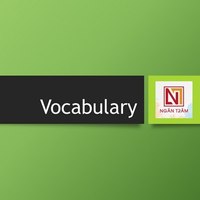
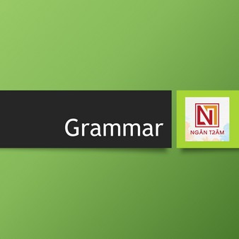
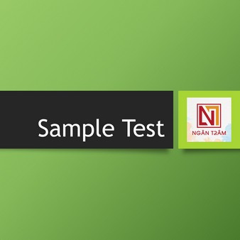

# 📋 TOEIC Resources

<figure><figcaption>
TOEIC Resources
</figcaption></figure>

Ở phần này, Ngân Trâm sẽ giới thiệu các tài nguyên giúp người học tự bổ sung kiến thức, kỹ năng tiếng Anh để có thể đạt được điểm cao trong kỳ thi TOEIC Listening & Reading

<figure><figcaption></figcaption></figure> <figure><figcaption></figcaption></figure> <figure><figcaption></figcaption></figure>

Tải dữ liệu [TẠI ĐÂY ](https://www.dropbox.com/scl/fo/bzpgpxw6j3n40msmbcrtn/h?rlkey=vc6qybi86jgs1kpwlhujjz2gr\&dl=0)


Answer sheet giúp làm các bài test mẫu thuận lợi, ghi chú lại quá trình rèn luyện



Tự đánh giá số điểm trong quá trình rèn luyện từ đó có kế hoạch học tập phù hợp

