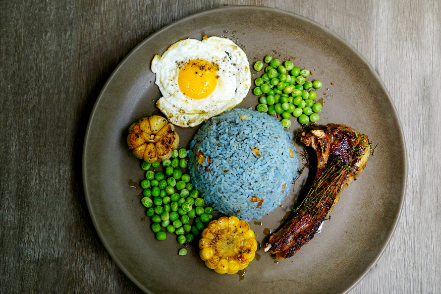

# 🤝 Chính sách hợp tác

<figure><figcaption>
Cơm sườn cừu thảo mộc
</figcaption></figure>

Yêu cái đẹp của món ăn Việt Nam, Ngân Trâm mong muốn đem lại cho khách hàng những trải nghiệm món ăn thuần Việt kết hợp với sự sáng tạo hiện đại phù hợp với nhịp sống mới của xã hội đang thay đổi từng ngày, từng giờ

#### Hình thức hợp tác

1. Chuyển nhượng công thức, phương pháp chế biến món ăn đặc biệt do đội ngũ Ngân Trâm sáng tạo (dừng)
2. Hợp tác bán lẻ sản phẩm (dừng)
