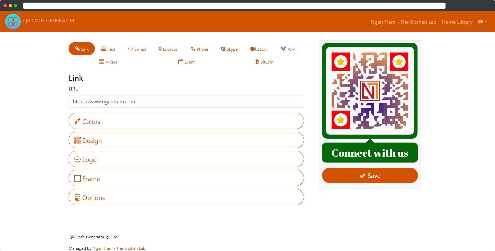

# 🔖 Thiết kế mã QR dùng cho in ấn

**Hướng dẫn tùy biến mã QR dùng cho in ấn**

In ấn và thiết kế là một phần cực kỳ quan trọng trong chiến lược marketing của mỗi quán cafe, nhà hàng. Một bản in chất lượng cao mang đến trải nghiệm dịch vụ thông suốt cho khách hàng từ đó hỗ trợ kinh doanh theo hướng tích cực

[Ngân Trâm - The Kitchen Lab](https://www.ngantram.com) có một hệ thống thiết kế mã QR hỗ trợ đối tác xây dựng kế hoạch [QR Marketing ](qr-marketing.md)cho riêng mình

Truy cập địa chỉ web

```
https://veno.es/qrcdr
```



Từ các mã QR đã được thiết kế và tùy biến riêng, tải về để sử dụng thiết kế cho các menu để bàn, để quầy, dán trước cửa quán, chia sẻ trên mạng xã hội...

.png>)


.png>)
